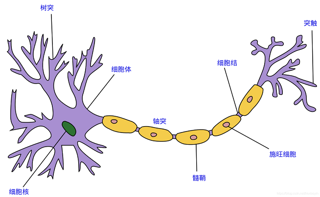

# AI：从生物人脑到数字大脑

在开始写《从零开始学大语言模型LLM》前，我构思了很久如何动笔。回顾这2个月的学习历程，感觉有两次不经意间的对话，让我受益匪浅。于是乎，决定从这两次对话开始写。

> 来自2023年8月的一次对话
> 
> > Carson：最近看了几篇AIGC的相关论文，比如Attention is all your needs，也大致也明白这些算法是如何工作的。但是我有一个疑惑，就是这些人是怎么想到这些方法的？
> > 阿甘：现代AI算法都是在模拟人脑，发现模拟的越来越像，效果越好。

## 算法，数据结构和人脑神经网络结构

为了对比计算机和人脑解决问题，我们先把算法（Algorithm）赋予更抽象的概念。

> **算法**：指解决问题的完整描述，由一系列准确可执行的步骤组成，其代表着解决问题的策略。

我们先来回顾一下计算机程序是如何工作的？

* 算法由程序描述，程序被转化成指令，指令被硬件（逻辑门结构）执行，这就实现了数据的逻辑运算。
* 算法本身却由人脑（也称人类智能）创造的，并通过算法控制计算机完成逻辑推理。

在此我们会发现，人脑可以构造算法，但计算机却不行，而算法才是逻辑推理的关键，那么这其中的奥秘是什么呢？

答案——结构

事实上，计算机的存储结构、传输结构与计算结构是独立分离的，但人脑神经网络结构，三者是合为一体的。因此，数据+算法，会存在于同一个**脑结构**之中。

如前所述，能够创造出算法是智能的关键所在，而在编程领域，著名程序员、开源软件运动的思想家、黑客文化的理论家——埃里克·雷蒙德（Eric Raymond），在《Unix编程艺术》中，有这样一个实践性的洞见——**算法**和**数据结构**有一个关系，即：

> 数据结构越复杂（如哈希表），算法就可以越简单，数据结构越简单（如数组），那么算法就需要越复杂。

例如，编程语言越是动态化（如Python、JavaScript），就越容易构建复杂结构，用其编写算法也就越容易，相反编程语言越是静态化（如C、C++、Java），就越难以构建复杂结构，用其编写算法就困难，而编程语言的演化是越来越动态化（如C#）。

为什么算法和数据结构有这样一个关系呢？其原理就在于，

* **算法**是逻辑关系的“计算映射”，即动态地进行逻辑关系的转化；
* **数据结构**是逻辑关系的“固化映射”，即将已经计算好的逻辑关系，存储在了结构之中。

可见，算法比数据结构多出了计算的过程——前者需要先计算后读写，后者仅需要根据结构的逻辑关系直接读写。所以，用数据结构进行逻辑关系的转化，会更加高效。
再来看一下人脑，人脑可以从环境信息中，提取数据结构并习得算法，最终将两者存储到脑结构之中。

这样我们得到一个结论，

> **神经结构、数据结构、算法**三者之间可以互相转化，或说互相表征。

换言之，如果数据结构足够强大，它就可以充当复杂算法的功能，甚至可以替代复杂的神经结构。

因此，计算机智能拟人（即模拟人脑）的一个途径，就是通过强化数据结构来模拟神经结构，以及弱化人类智能所提供的代码实现的算法，转而使用数据结构去生成算法，而这就是目前人工智能的发展方向。

至此，我得出了学习人工智能/机器学习过程中最重要的两大关键。

1. 网络结构
2. 模拟人类

## 人脑是如何工作的

要用计算机模拟人脑，我们先得搞清楚人脑中最基本的单元——神经元。

### 神经元结构

我们从最简单的开始，先看一下人体神经元的结构图，如下图所示：


**神经元**（Neuron），是组成神经系统结构和执行神经功能活动的一大类高度分化细胞，由胞体和胞突（树突和轴突）组成，属神经组织的基本结构和功能单位。神经元大致分为三类：感觉（传入）神经元，运动（传出）神经元，联络（中间）神经元。

### 神经元工作过程

工作过程：其他神经元的信号（输入信号）通过树突传递到细胞体，细胞体把其他多个神经元传递过来的输入信号进行合并加工，然后通过轴突（输出信号）传递给别的神经元。

来自Wikipedia的解释，该过程专业术语叫**动作电位**（action potential），指的是静止膜电位状态的细胞膜受到适当刺激而产生的，短暂而有特殊波形的跨膜电位搏动。细胞产生动作电位的能力被称为兴奋性，有这种能力的细胞如神经细胞和肌细胞。动作电位是实现神经传导和肌肉收缩的生理基础。
一个初始刺激，只要达到了**阈电位**（threshold potential），不论超过了多少，也就是全有全无律，就能引起一系列离子通道的开放和关闭，而形成离子的流动，改变跨膜电位。

综上所示，整个过程有5个重要的概念

1. 输入
2. 对输入信号的处理
3. 阈值
4. 激活（超过阈值，引起通道的开发和关闭）
5. 输出

现在，我们画一个模拟图，来模拟神经元工作过程。


### 用数学来表示神经元

在开始这一章节前，先把时间拨回到2017年。

> 来自2017年的一次办公室闲聊
> 
> > Carson：最近计算机业界出了几个很火的概念，我周末花了点时间看了一下，结果感觉就是旧瓶装新酒……
> > 杨博士：计算机本身不难，难的是数学。
> > Carson：噢，数学……

至那以后，我每每遇到工作和学习的难题时，都会自然而然的用数学思维来思考。原先一些很难掌握的知识点，比如函数式编程，就直接秒懂了。这种感觉很妙，你也不妨试试……

言归正传，现在我们将上文终结出来的5个概念，即输入，处理，阈值，激活和输出，用数学表示出来。

参考我们熟悉的一次函数，我们用$x_i$表示输入；用$y$表示输出。因为有多路输入，所以我们还要引入权重（Weight）这个概念。对于输入的处理，就对应数学里的函数$f(x)$，我们一般用线性方程，比如求和$\sum$表示。阈值，我们用一个常量bias表示，简写为$b$。激活，也对应于数学中的函数，我们称之为激活函数（Activation Function）,我们用$\sigma$来表示，一般是非线性函数，比如ReLU，Sigmod等函数。

那么，我们就得到了下图。


其实这个图就是McCulloch和Pitts在1943年提出来的M-P神经元模型，并由此模型发展出了感知机（Preceptron）。而这个从左到右，即从输入到输出的过程，在机器学习里的专业术语叫**前向传播**（Forward Propagation）。整个过程，我们只用一个数学就可以表示出来：

$$
y = \sigma(\sum_{i=1}^n w_ix_i + b)
$$

至此，我们已经用计算机模拟出最简单的神经元了。有了单个神经元（感知机），就能将多个神经元连接成神经网络（MLP，多层感知机），这样我们就用计算机模拟出了人脑结构。


现在我们已经计算机模拟出了人脑，如同一个刚刚出生的婴儿。婴儿要长大，就开开始学习啦。接下来，我们来谈谈学习这件事情。

## 人脑是如何学习的

人脑的运作原理，简单地讲，它是这样运作的（摘自知乎）：

人类通过感知系统(比如视觉，听觉等)输入信息，输入的信息不断地被大脑神经元系统并行地处理，层层向上抽象，整个抽象过程是基于大脑特定的结构设计决定的，不是一团没有设计的神经元混沌，而是一条有规则的组合关系。信息不断地流入，模式提取和预测奖惩同时运作，分布式的神经元激活指代着各种实体以及实体间的关系。运用已经观察到的实体及关系，我们进行着新的学习和预测。一旦，遇到新鲜的模式，我们就会重构已有的记忆以熵最小化的形式进行记忆，新的记忆指导新的行动，并帮助你理解新的事物。

上述文字信息量还是比较大的，我们来讨论提到几个重要的过程。

1. 感知系统，处理视觉，听觉等输入信息。对应**数据采集**
2. 对信息的抽象和提取。对应**数据编码**
3. 把提取的信息，按照规则组合关系激活分布式神经元，建立神经元连接。对应**数据存储**
4. 遇到新模式，重构已有记忆（即重构神经元连接）帮助理解新事物。对应**数据检索**
5. 学习的过程需要很多轮，同时还要有奖惩机制，即多巴胺机制。

### 用数学来表示学习的过程

先回顾一下感知机的构成，有输入$x_i$;权重$w_i$;函数$\sum$;阈值$b$;激活函数$\sigma$;输出$y$。然后结合上文的5个过程，我们很容易就能想到用输入$x_i$对应数据采集。而数据编码即数据存储不是那么一目了然。但是，我们仔细看一下感知机，函数$\sum; \sigma$一旦选定就不变了，只有权重$w_i$和阈值$b$是可以随意改变，并可以保存。
瞧，数学总是这么一目了然，至此我们找到了机器学习的本质：

> 机器学习本质就是用各种各样的数学手段，来调整权重(Weight)

Tips: 在实际应用中，我们把阈值$b$，直接写作$w_b$，也作为权重进行训练。本文不区分这两个概念，统称为权重。

#### 损失函数

还有最后一个过程我们需要用数学来表示，多轮的学习和奖惩机制。
回顾一下当你学习的时候，大脑会发生重要变化。即在神经元之间建立新连接——这种现象被称为神经可塑性(Neuroplasticity)。练习得越多，这些连接就会变得越牢固。当连接加强时，信息(神经冲动)的传输速度越来越快，也更有效率。这里，我们用权重来表示神经元的连接强度。
谈到奖惩机制，我们首先要解决的就是输出$y$是不是就是“正确答案”。对比输出$y$是否接近“正确答案”这一过程，类似于人类学习中的考试，分数越高表示越接近正确答案。
举个例子，在满分为100分的考试中，得分98分的学生A，比得分为85分的学生B，更应该收到奖励。
我们做一个等式变形，

* 学生A离目标分数100分的距离$J(\theta_a) =\vert 98-100 \vert = 2$
* 学生B离目标分数100分的距离$J(\theta_b) = \vert 85-100 \vert = 15$
  显然这里的距离$J(\theta)$越小越好。在机器学习中，这个距离函数，我们称之为**损失函数**（Loss Function)。

就如图灵奖得主、卷积神经网络之父——杨立昆（Yann LeCun），在《科学之路》中，所说：

> 所谓的机器学习，就是机器进行尝试、犯错和自我调整的操作。学习就是逐步减少系统误差的过程。训练机器的过程就是调整参数的过程。……基于损失函数最小化的学习，是人工智能运作的关键要素。通过调整系统参数来降低损失函数，也就是降低实际输出与期望输出之间的平均误差。实际上，最小化损失函数和训练系统是一回事。

#### 梯度下降和反向传播

我们已经知道训练的过程，就是使得损失函数最小化的过程，需要用到最优化算法。一般而言，损失函数很复杂，参数很多，很难用数学方程直接求得最小值。我们往往采用无限逼近的办法求得近似值，这个数学方法正式名称叫**梯度下降**。如上文所述，我们的最终目的是更新权重$w_i$,而这个过程我们用到了**反向传播**。梯度下降和反向传播是机器学习中常用的优化算法。梯度下降是一种迭代算法，用于最小化损失函数。它通过计算损失函数相对于模型参数的梯度来更新模型参数。反向传播是一种计算梯度的方法，它使用链式法则来计算损失函数相对于每个模型参数的梯度。这些梯度可以用于更新模型参数，以便最小化损失函数。

##### 梯度下降

举个例子，来体会一下梯度下降算法。
[已知] 一个损失函数为二次函数，表达式: $g(x) = (x-1)^2$，函数图像如下图示：
[求] 用梯度下降的办法，求得$g(x)$最小值。

_1.png)

[解] 虽然我们可以中学的数学知识，一眼就能得出$g(x)$最小值为：$g(1) = 0$。
现在我们用梯度下降算法，体会一下。先随机取一个$x$，比如$x=3$, 我们需要向左移动$x$, 也就是必须减小$x$，使得$g(x)$减少，即下降，如图。

_2.png)

同理，如果随机取一个$x$，比如$x=-1$, 我们需要向右移动$x$, 也就是必须增加$x$，使得$g(x)$减少，即下降，如图。
_3.png)

如何用数学表示这个过程呢？对，用微分！我们对$g(x) = (x-1)^2$求导后，得到：

$$
\frac{d(g(x))}{dx} = 2x - 2
$$

我们可以根据导数的符号相反的方向移动$x$, $g(x)$就会自然而然的沿着最小值的方向前进了，我们再人为的给定一个常量作为步长$\eta$，来实现参数$x$的自动更新。过程如下图所示。
_4.png)
上述过程就是梯度下降算法的核心思想，现在我们将这个过程用数学来表示出来

$$
\widehat x = x -\eta \frac{d(g(x))}{dx}
$$

这里$\widehat x$，表示新的$x$值；$\eta$在机器学习里的专业术语叫做**学习率**，是一个正的常数。我们根据学习率的大小，到达最小值的更新次数也会发生变化，即收敛速度会不同。甚至会出现完全无法收敛，一直发散的情况。这部分就不具体展开了，留给读者自己寻求答案吧。上面这个例子，读者可以试试初始值：$\eta = 1, x=3$ 这种情况。

理解和梯度下降的算法思想后，我们对上述这个例子做一下推广（相当于数学的扩域），使得其能更加符合实际情况。实际上，损失函数要比上面例子提到的二次函数要复杂的多，我们拿最简单的均方差（MSE: Mean Square Error）公式举例：

$$
J(\theta) = \frac{1}{n}\sum_{i=1}^n(y^{(i)}-f_{\theta}(x^{(i)}))^2
$$

实际工作中，自变量个数要远大于1，这里我们就要用到**偏微分**这个数学工具了。我们讨论一下MSE公式，$f_{\theta}(x)$有n个参数$\theta_0,\theta_1,..., \theta_n$, 那么更新表达式表示成：

$$
\widehat \theta_0 = \theta_0 -\eta \frac{\partial J}{\partial \theta_0} \\
\widehat \theta_1 = \theta_1 -\eta \frac{\partial J}{\partial \theta_1} \\
\cdot \cdot \cdot \\
\widehat \theta_n = \theta_n -\eta \frac{\partial J}{\partial \theta_n}
$$

额，这么多条公式... 显然不符合数学审美观，我们引入几个数学概念来简化上述公式。

* 向量$\vec{\theta} = \left[\begin{matrix}\theta_0 \\ \theta_1 \\ ... \\ \theta_n \end{matrix}\right]$ 表示：变量$\theta_0, \theta_1 ,...,\theta_n$.
* $\theta_t$表示：第$t$次迭代后的模型参数
* 梯度$\nabla{J(\theta_t)}$表示：$\frac{\partial J}{\partial \theta_0}, \frac{\partial J}{\partial \theta_1}, ..., \frac{\partial J}{\partial \theta_n} $

现在，我们用一条漂亮的数学公式来表示梯度下降算法了，公式如下：

$$
\vec \theta_{t+1} = \vec \theta_t - \eta \nabla{J(\theta_t)}
$$

##### 反向传播

在开始讲反向传播之前，我们先复习一下感知机和正向传播过程。一个简单的感知机，如下图所示：


接着，我们加入了损失函数，来衡量输出$y$和我们的目标之间的差值，如下图所示：


前文提到，机器学习最终目的就是调整权重。根据梯度算法的数学公式

$$
\vec \theta_{t+1} = \vec \theta_t - \eta \nabla{J(\theta_t)}
$$

可知，我们需要求得$\frac{\partial J}{\partial w_1}; \frac{\partial J}{\partial w_2}$, 以便算出权重$\widehat w_1; \widehat w_2$，并更新。计算公式表示如下：

$$
\widehat w_1 = w_1 - \eta\frac{\partial J}{\partial w_1} \\
\widehat w_2 = w_2 - \eta\frac{\partial J}{\partial w_2}
$$

由上图可知，$J(\theta)$ 和 $w_i$，还有两个函数：$\sum$和$\sigma$。为了解决这个问题，我们需要引入新的数学工具——链式法则。我们先看一下什么是链式法则。

> 链式法则是微积分中的一种求导法则，用于求解复合函数的导数。当一个函数是由两个或多个函数组成时，链式法则可以帮助我们找到这个复合函数的导数。链式法则的正式表述如下：设 $y=f(u), u=g(x)$ ，则 $y$ 关于 $x$ 的导数为$\frac{dy}{dx} = \frac{dy}{du} \cdot \frac{du}{dx}$。

运用链式法则，我们就能求得$\widehat w_1; \widehat w_2$，计算公式如下：

$$
\vec w_{i+1} = \vec w_i - \eta\frac{\partial J}{\partial w_i} = \vec w_i - \eta \cdot \frac{\partial \sum}{\partial w_i} \cdot \frac{\partial \sigma}{\partial \sum} \cdot \frac{\partial J}{\partial \sigma}
$$

Tips: 数学上，这个公式不够严谨，请大家包涵。重点放在理解算法的运作过程。
现在，我们把整个过程画出来，如下图所示：


这样一个完整的机器学习算法，即梯度下降算法，就讲完了。一句话终结，通过前向传播和反向传播两个过程，不断的降低损失，并持续更新权重值。下一节，我们会通过一个实际例子和代码来加深理解机器学习中的梯度下降算法。

## 例子：手撕梯度下降算法

在这一节里面，我们将用一个例子来详细解释梯度下降算法的工作原理，并用Python代码来实现该例子。

### 神经网络示意图


#### 已知条件：

1. 输入：$x_1=1; x_2=2$
2. 初始权重：$w_{11}=1; w_{12}=1; w_{21}=1; w_{22}=-1; w_{a1}=1; w_{a2}=-1$
3. 初始偏置量(Bias)：$b_{11}=1; b_{12}=2; b_{21}=1$
4. 目标输出：$Y=2$
5. 激活函数(Activate Function): Relu
6. 学习率(Learning rate): $\eta=0.01$
7. 损失函数(Loss Function)：$J(w,b) = \frac{1}{2}\cdot (y-Y)^2$

Tips：原始实例来自抖音@教AI的陶老师，我做了一定的修改。

### 解题步骤

#### Step 1/3: 前向传播过程

##### 计算$z_1; a_1; z_2; a_2; y$的值

$ z_1 = w_{11}\cdot x_1 + w_{21}\cdot x_2 + b_{11} = 1\times1 + 1\times2 + 1 = 4 $
$ a_1 = Relu(z_1) = 4$
$ z_2 = w_{12}\cdot x_1 + w_{22}\cdot x_2 + b_{12} = 1\times1 + (-1)\times2 + 1 = 0 $
$ a_2 = Relu(z_2) = 0$
$ y = w_{a1}\cdot a_1 + w_{a2}\cdot a_2  + b_{21} = 1\times4 + (-1)\times0 + 1 = 5$

#### Step 2/3: 反向传播过程

##### 计算权重$w_{11}$梯度

$w_{11-grad} = \frac{\partial(J)}{\partial(w_{11})} = \frac{\partial(J)}{\partial(y)} \cdot \frac{\partial(y)}{\partial(a_1)}\cdot \frac{\partial(a_1)}{\partial(z_1)}\cdot \frac{\partial(z_1)}{\partial(W_{11})} = (y-Y)\cdot w_{a1} \cdot 1 \cdot x_1 = (5-2)\times1\times1\times1 = 3$

##### 计算$\widehat{w_{11}}$

$\widehat{w_{11}} = w_{11} - \eta \cdot w_{11-grad} = 1 - 0.01 \times 3 = 0.97$
同理，计算其他参数 $\widehat{w_{12}}; \widehat{w_{21}}; \widehat{w_{22}}; \widehat{w_{a1}}; \widehat{w_{a2}}$ 的值

#### Step 3/3: 更新模型参数

用新的参数值 $\widehat{w_{11}}; \widehat{w_{12}}; \widehat{w_{21}}; \widehat{w_{22}}; \widehat{w_{a1}}; \widehat{w_{a2}}$ 替换掉原来的参数 $w_{11}; w_{12}; w_{21}; w_{22}; w_{a1}; w_{a2} $，标志着一轮训练已经完成

### 实现代码

```python
import torch
import torch.nn.functional as F

# Define sample tensor
x1 = torch.tensor(1)
x2 = torch.tensor(2)
Y = torch.tensor(2)

# Define weight, bias and learning rate
w11 = torch.tensor(1.0, requires_grad=True)
w12 = torch.tensor(1.0, requires_grad=True)
w21 = torch.tensor(1.0, requires_grad=True)
w22 = torch.tensor(-1.0, requires_grad=True)
wa1 = torch.tensor(1.0, requires_grad=True)
wa2 = torch.tensor(-1.0, requires_grad=True)
b11, b12, b21 = torch.tensor([1.0, 1.0, 1.0], requires_grad=True)
learning_rate = 1e-2

# Step 1/3: Forward propagation
z1 = w11 * x1 + w12 * x2 + b11
a1 = F.relu(z1)
z2 = w21 * x1 + w22 * x2 + b12
a2 = F.relu(z2)
y = wa1 * a1 + wa2 * a2 + b21

# Calculate loss
loss = ((y - Y)**2)/2

# Step 2/3: Backward propagation
# calculate gradients
w11_grad = (y - Y) * wa1 * 1 * x1
print(w11_grad)

# Step 3/3: Update parameters
w11 = w11 - learning_rate * w11_grad
print(w11)
```

## 小结

#### 梯度下降算法

梯度下降算法的数学原理是，通过计算损失函数相对于模型参数的梯度来更新模型参数。梯度是一个向量，它指向损失函数增加最快的方向。因此，通过沿着梯度的反方向更新模型参数，可以最小化损失函数。梯度下降算法的更新规则如下：

$$
\vec \theta_{t+1} = \vec \theta_t - \eta \nabla{J(\theta_t)}
$$

其中，$\theta_t$是第$t$次迭代后的模型参数，$\eta$是学习率，$\nabla{J(\theta_t)}$ 是损失函数 $J$相对于模型参数$\theta_t$的梯度。

##### 反向传播

反向传播算法的数学原理是，使用链式法则计算损失函数相对于每个模型参数的梯度。链式法则是一种计算复合函数导数的方法。在神经网络中，每个层都可以看作是一个函数，它将输入映射到输出。通过使用链式法则，可以计算出损失函数相对于每个层的输入和权重的梯度。这些梯度可以用于更新模型参数，以便最小化损失函数。

链式法则是微积分中的一种求导法则，用于求解复合函数的导数。当一个函数是由两个或多个函数组成时，链式法则可以帮助我们找到这个复合函数的导数。链式法则的正式表述如下：设 $y=f(u), u=g(x)$ ，则 $y$ 关于 $x$ 的导数为$\frac{dy}{dx} = \frac{dy}{du} \cdot \frac{du}{dx}$。这个公式可以推广到多元函数的情况。例如，如果 $z=f(x,y), x=g(t), y=h(t)$，则$z$关于$t$的导数为$\frac{dz}{dt} = \frac{\partial z}{\partial x} \cdot \frac{dx}{dt} + \frac{\partial z}{\partial y} \cdot \frac{dy}{dt}$。这个公式被称为多元复合函数求导法则。

## 参考文献

1. [深度学习之学习笔记（三）——神经元的工作原理](https://blog.csdn.net/linxiaoyin/article/details/104082552)
2. 《白话机器学习的数学》
3. [人类智能：有关推理、逻辑、因果、预测、学习、算法、想法与一切](https://zhuanlan.zhihu.com/p/367521429)
4. [智能的本质：人工智能与人类智能](https://zhuanlan.zhihu.com/p/269284598)

